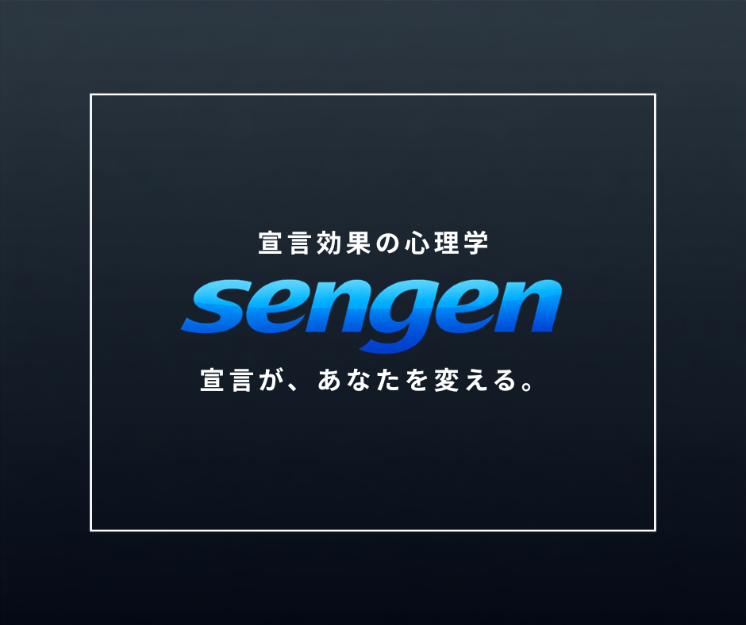

  

<h1 align="center">kurochan｜くろちゃん</h1>

  
  
  

  オンラインスクール「RUNTEQ」にてRuby on Rails を中心とした、学習を行っております。 
  現在はWebアプリ開発のスキルを磨きつつ、エンジニア転職を目指しています。

## Tech Stack

## Projects

### SENGEN

  

---

Thanks for visiting my profile!

